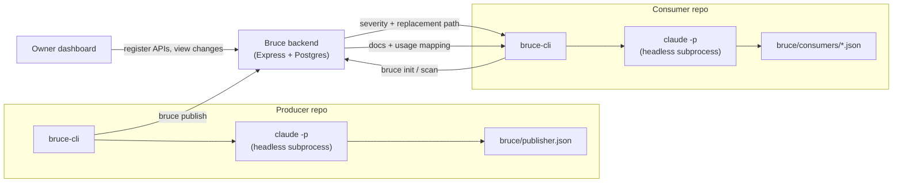
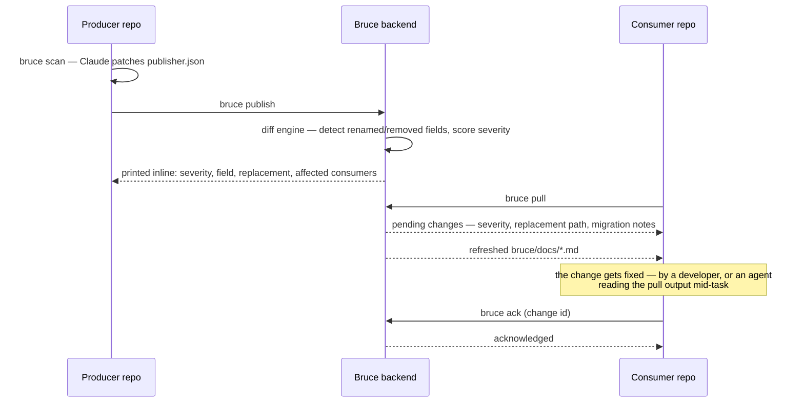

# bruce-cli

**Change intelligence for AI coding agents.** Bruce tells Claude (or any coding agent) the thing it can't know just by reading your repo: who else depends on this API, which fields are actually critical, what just changed upstream, and exactly how to migrate — before a breaking change ships, not after it's already in production.

[](https://www.npmjs.com/package/@martin_mohammed/bruce-cli)
[](https://www.npmjs.com/package/@martin_mohammed/bruce-cli)
[](./LICENSE)
[](https://nodejs.org)

---

## The problem

```
API owner renames a field
        │
Changelog / Slack message / docs — easily missed
        │
Consumer finds out when it breaks in production
        │
An AI agent patches the symptom, with no idea what else
depends on the old shape
```

An AI agent can write code fast. It has no way to know that a field it just touched is read by three other repos, one of which treats it as billing-critical. Bruce is the layer that gives it that context.

## How it fits together

`bruce-cli` is the half of Bruce that lives in *your* repo. It talks to a Bruce backend — the hosted one at **[bruce-brown.vercel.app](https://bruce-brown.vercel.app)** by default — which holds the shared dependency graph across every repo registered with it.



Every command that needs to actually read your code spawns Claude as a **separate headless subprocess** (`claude -p`, prompt piped over stdin, restricted to `Read`/`Grep`/`Glob`/`Edit`/`Write`/`git diff`) — not the session you're typing into. Its output is never trusted blind: written to a snapshotted file, parsed, and validated against a shared schema before anything is kept. If it fails or times out, your previous file is restored untouched.

## Install

```bash
npm install -g @martin_mohammed/bruce-cli
```

**Requirements:**
- Node.js ≥ 20
- Git — every command needs to already be inside a git repository (Bruce tracks incremental changes off git history)
- [Claude Code](https://claude.com/claude-code), installed and authenticated — `bruce-cli` shells out to it directly

## Quickstart

The fastest path doesn't involve typing any of this by hand: sign up at [bruce-brown.vercel.app](https://bruce-brown.vercel.app), register your API, and copy the generated setup prompt straight into a Claude Code session open in your repo — it installs the CLI if needed and runs the exact command below with your real key already filled in.

Doing it by hand looks like this:

```bash
# In the repo that owns an API:
bruce init --role publisher --api-key <key> --bruce-url https://d3htn4q2svtb7i.cloudfront.net
bruce publish

# In a repo that calls that API:
bruce consumer add --url https://d3htn4q2svtb7i.cloudfront.net --token <token>
bruce init
```

## How the core loop works



Severity comes from the field's own declared criticality (assigned when the API was first scanned), not from guessing how a rename "sounds." Every affected consumer is identified before the change even reaches them.

## Commands

| Command | What it does |
|---|---|
| `bruce init` | Full scan — registers this project's role (publisher or consumer) and generates its contract/mapping file. Non-interactive: `--role <publisher\|consumer> --api-key <key> --bruce-url <url> --token <token>`. |
| `bruce scan` | Incremental — diffs git history since the last scan and has Claude patch only what changed, instead of a full re-scan. |
| `bruce update` | Alias for `bruce scan`, scoped to this project's consumer-role mapping files. |
| `bruce publish` | Publisher only. Pushes `bruce/publisher.json`; prints every breaking change detected, with severity and affected consumers. |
| `bruce pull` | Consumer only. Fetches pending changes from every registered upstream dependency, and refreshes the local API docs. |
| `bruce ack <changeId>` | Marks a specific pulled change as handled. The id is printed inline by `bruce pull`. |
| `bruce consumer add --url <url> --token <token>` | Registers this repo as a consumer of an upstream API and downloads its docs, without doing a full scan. |
| `bruce status` | Local only, no network call — what's registered, when it was last scanned, whether a scan is due. |

Run `bruce <command> --help` for the full flag reference on any of these.

## What ends up in your repo

```
your-repo/
  bruce/
    publisher.json              # only if this repo owns an API
    consumers/
      <producer-slug>-map.json  # one per upstream API this repo calls
      index.json
    docs/
      <producer-slug>-api-doc.md  # the upstream API's current docs — gitignored, kept fresh by `bruce pull`
    .credentials.json           # tokens — gitignored, never a file Claude is asked to read or write
  .bruce/
    state.json                  # local scan checkpoints, machine-only
```

Add this to your `.gitignore`:

```
.bruce/
bruce/.credentials.json
bruce/docs/
```

(`bruce/publisher.json` and `bruce/consumers/*.json` are meant to be committed — they're your API's actual contract, worth tracking in version control like any other source file.)

## Contributing

Issues and pull requests are welcome. This CLI is one piece of a larger platform (backend + dashboard); this repo covers the client you actually run.

## License

[MIT](./LICENSE)
